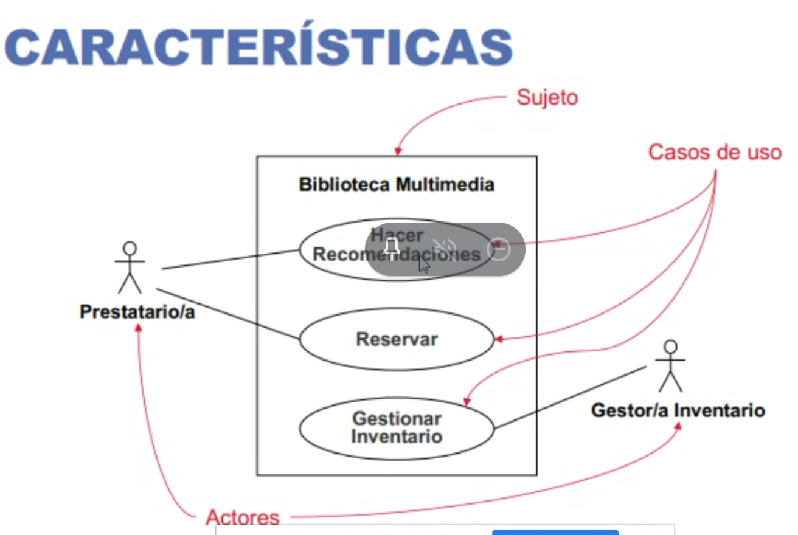
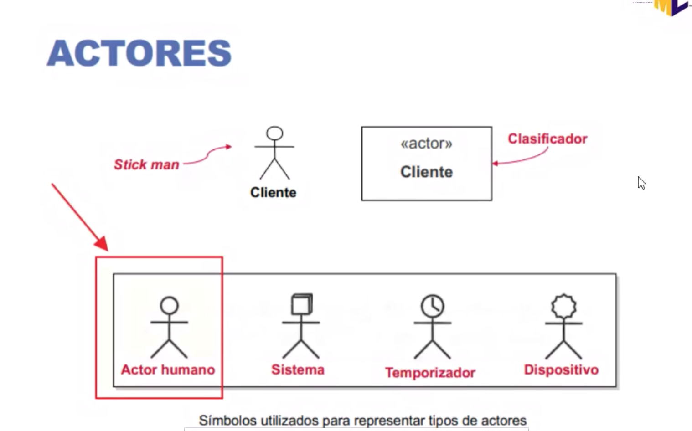
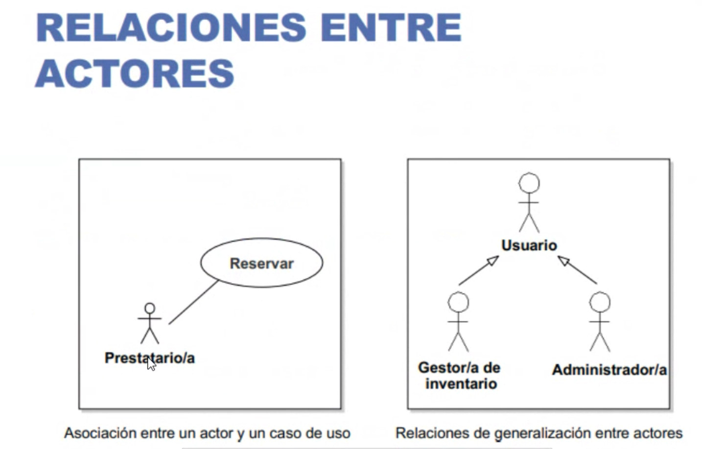
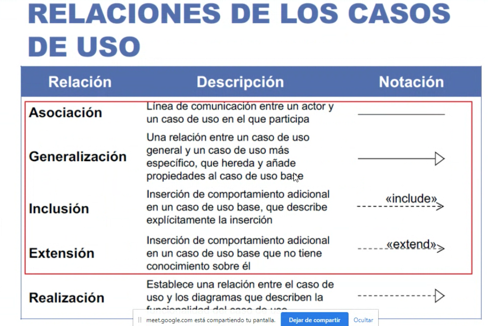
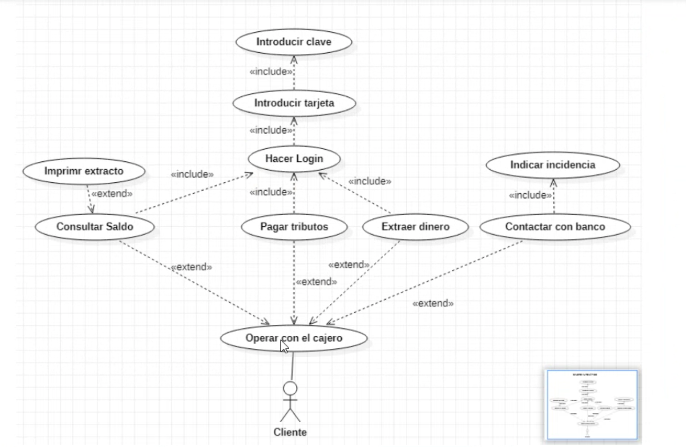
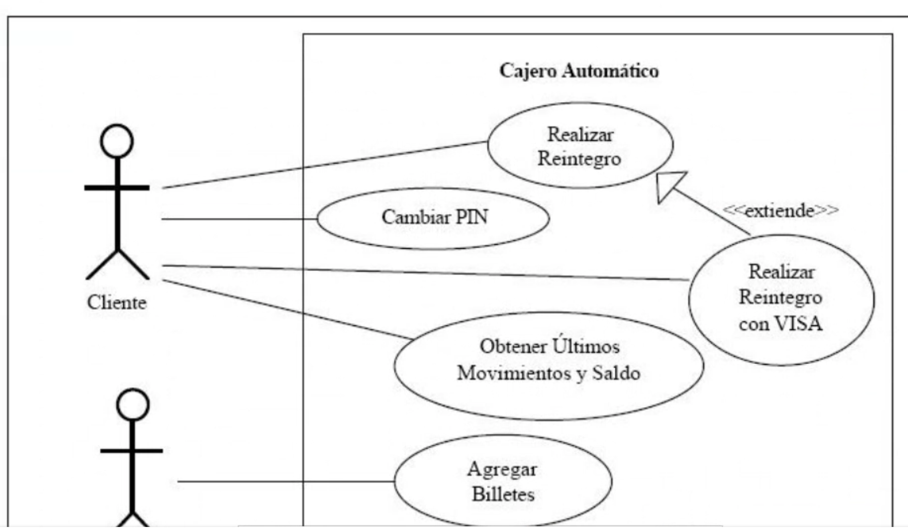
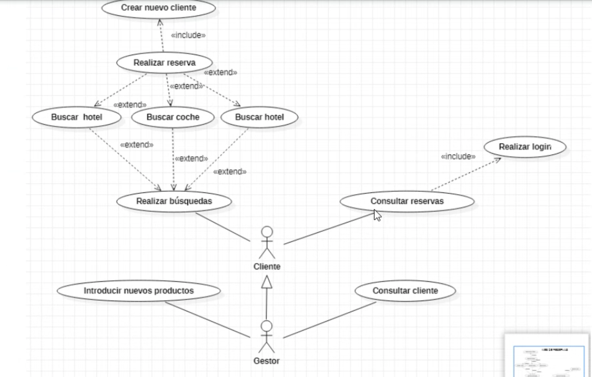

# Proyecto AgrOS

## Proyecto fin de grado superior de programación de aplicaciones multiplataforma DAM
- Centro: IES El Rincón. Las Palmas de Gran Canaria
- Director de proyecto: D. Salvador Bordón Ruano
- Autor: Antonio Miguel García del Río <agarciadelrio@gmail.com>

## Descripción
Aplicación online para la gestión de una explotación agrícola de pequeña escala y la generación de los documentos necesarios, como el Cuaderno de Campo, para su presentación a la Administración Local.
Estará basado en una solución Cliente/Servidor web mediante PHP, JavaScript, HTML y CSS procurando usar todos los estándares posibles con vista a su libre distribución para la comunidad de pequeños agricultores. He elegido este stack de desarrollo por ser uno de los más utilizados hoy en día y se encuentra totalmente implantado desde hace años lo cual avala su estabilidad y garantiza su despliegue en prácticamente cualquier ISP o servidor local.

### Documentación de referencia
- Gobierno de Canarias Cuadernos de Campo [https://www.gobiernodecanarias.org/agricultura/temas/cuaderno/]

### Nombre de la Aplicación
> __Cuaderno de Campo AgrOS__

### Aplicaciones similares
- GOIA [https://www.goia.es/]
- AGRICOLUM [https://agricolum.com/]
- SBAGRICOLA [https://www.sbsoftware.es/sector-agricola/]
- AGROPTIMA [https://www.agroptima.com/es/]
- AGROCEA [http://www.agrocea.es/]
- AGROSLAB [https://www.agroslab.com/] [https://www.cuadernoexplotacion.es/]
- ORCELIS [https://orcelis.com/]
- NERTHUS [https://nerthus.es/]

### Tecnologías a utilizar
- Servidor Web Apache2 [http://apache.org/]
- Base de datos MySQL [https://www.mysql.com/]
- Lenguage PHP [https://php.net/]
- ORM RedBeanPHP [https://www.redbeanphp.com/]
- HTML5 [https://developer.mozilla.org/es/docs/HTML/HTML5]
- CSS3 [https://developer.mozilla.org/es/docs/Web/CSS]
- CSS Framework Bootstrap4.0 [https://getbootstrap.com/]
- Iconos Font Awesome [https://fontawesome.com/]
- TypeScript [https://www.typescriptlang.org/]
- JavaScript [https://developer.mozilla.org/es/docs/Learn/JavaScript]
- jQuery [https://jquery.com/]
- Framework MVVM KnockoutJS (JS reactivo) [https://knockoutjs.com/]
- GoogleMaps API [https://developers.google.com/maps/documentation/javascript/overview]

### Herramientas de desarrollo
- Drawio [https://app.diagrams.net/]
- Docker [https://www.docker.com/]
- Pug [https://pugjs.org/]
- SASS [https://sass-lang.com/]
- Parcel [https://parceljs.org/]
- Gulp [https://gulpjs.com/]
- NodeJS [https://nodejs.org/]
- Visual Studio Code [https://code.visualstudio.com/]
- GitHub [https://github.com/]
- MarkDown [http://markdown.github.io/]
- Google Chrome [https://www.google.com/intl/es_es/chrome/]

### Tipos de usuarios
- Administrador
- Propietario
- Productor
- Trabajador
- Cliente

#### Casos de uso (Modelado)
- Contexto (Dónde se va a utilizar)
- Acciones (Funcionalidades / Verbos)
- Actores (Usuarios)

|Ejemplos:||
|-|-|
|||
||
||
||

### Casos de uso
- Login
  - Descripción: Sistema de autentificación de usuario.
  - UML: [link GDrive](https://app.diagrams.net/#G1TtF6zmJNXWAdLUo_rMzFlrhnO4P2XRmn)
- Registro
  - Descripción: Si el usuario no tiene cuenta se puede dar de alta rellenando un formulario.
  - UML: [link GDrive](https://app.diagrams.net/#G1TtF6zmJNXWAdLUo_rMzFlrhnO4P2XRmn)
- Recordar contraseña
  - Descripción: Si el usuario ha olvidado su contraseña puede solicitar cambiarla vía correo electrónico.
  - UML: [link GDrive](https://app.diagrams.net/#G1TtF6zmJNXWAdLUo_rMzFlrhnO4P2XRmn)
- Explotación (Datos generales de la explotación)
  - Descripción: Ficha de los datos esenciales de la explotación. Nombre, dirección, coordenadas GPS, teléfono, NIF, Nº Registro sanitario, Nº Catastro, etc.
  - Elementos:
    - Conexión con Catastro
      - Descripción: Intentar usar el API del catastro para obtener gráfico de la explotación.
    - Conexión con GoogleMaps
      - Descripción: Intentar usar el API de GoogleMaps para mostrar imagen de satélite.
- Parcela
  - Descripción: La explotación se encuentra subdivida en parcelas.
  - Elementos:
    - Conexión con Catastro
      - Descripción: Intentar usar el API del catastro.
    - Editor de formas y ubicación de las parcelas
      - Descripción: Mini editor gráfico en SVG para polígonos básicos que pueda siluetear las parcelas de las explotación.
- Proveedores
  - Descripción: Contactos a los que se compran o contratan productos y servicios.
  - Elementos
    - Pedidos a proveedores
    - Facturas de compra
- Productos (Inventario)
  - Descripción: Mini gestión de inventario, básicamente control de material y productos (Stock)
  - Elementos:
    - Semillas
    - Abonos
    - Fitosanitarios
    - Herramientas
      - Garantías
    - Vehículos
      - Seguros
      - Revisiones
- Siembras (Cultivos)
  - Descripción: Cada vez que el usuario hace una nueva plantación. Semillas usadas, cantidades, modo de siembra, etc.
- Riegos
  - Descripción: Cada vez que el usuario riega o fertiriega. Horas, litros, tipo (goteo, manguera, acequia), etc.
- Abonados
  - Descripción: Productos usados para abonar, químicos, naturales.
- Tratamientos
  - Descripción: Productos usados, químicos, naturales.
- Análisis
  - Descripción: Fecha y resultados de las analíticas fisico químicas.
  - Elementos
    - Agua
    - Tierra
    - Residuos
- Cosechas (Recolección)
  - Descripción: Fechas, tipos de hortalizas, modo de cosecha (manual, maquinaria).
- Clientes
  - Descripción: Contactos que compran productos de la explotación (Empresas y particulares).
- Ventas
  - Descripción: Facturación de ventas de productos.
  - Elementos
    - Pedidos
    - Albaranes
    - Facturas
- Cuadernos
  - Informes (Cuaderno de Campo)
  - Trazabilidad
- Protección de datos
  - Cookies
  - Política de privacidad
  - Términos y condiciones
  - RGPD [link europa.eu](https://europa.eu/youreurope/business/dealing-with-customers/data-protection/data-protection-gdpr/index_es.htm)

### Acerca de
- Info del autor
  - Antonio Miguel García del Río
  - <agarciadelrio@gmail.com>
- Versión 0.1
- Licencia de uso GPL v.3

## Mockups

## Enlaces
- [AgrOS main page](../README.md)

